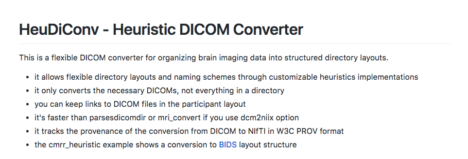
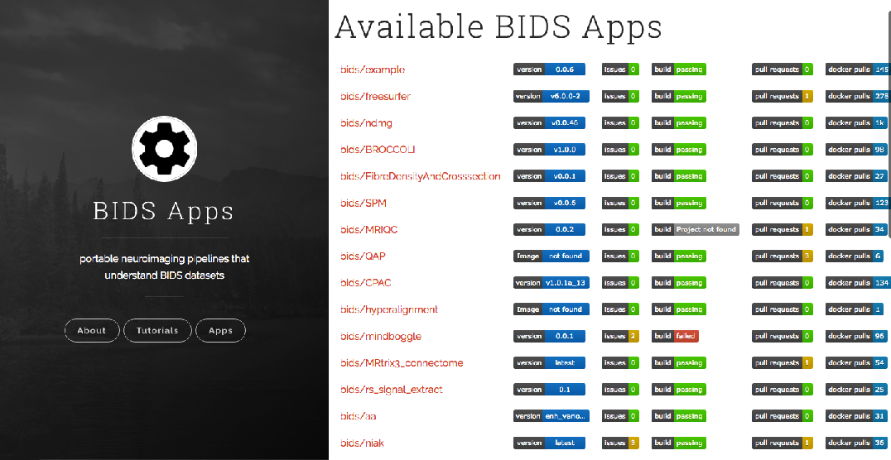

name: inverse
layout: true
class: center, middle, inverse
---
# From DICOM to a BIDS dataset
### mathiasg@mit.edu

---
name: content
layout: false

## Roadmap

.middle[
.center[
### [Data and BIDS](#datamanage)
### [Heudiconv](#heudiconv)
### [Interactive Conversion](#conversion)
### [Extra pieces](#extrasteps)
### [BIDS-Apps](#nowwhat)
]
]

---
name: datamanage

### Data management

- Large amounts of variety of scans acquired during acquisition

 - Anatomical
 - Functional
 - Diffusion
 - Field maps

--

- Lack of data storage/organization standard in neuroimaging community

--

- This can lead to problems:
  - harder to share data (even in same lab)
  - separate tracking of specific metadata when processing dataset
  - is my dataset missing anything?
---
## [Brain Imaging Data Structure](http://bids.neuroimaging.io) (or BIDS)


.right[*Gorgolewski, K. J. et al. 2016*]


???

result of collaboration from over 5000 researchers.

---
name: heudiconv

### Easiest way to convert to BIDS?

#### [Heudiconv](https://github.com/nipy/heudiconv)



--

- With docker, it's as easy as `docker pull nipy/heudiconv`

--

- Without docker, you'll need these requirements
    - `python 2.7`
    - `nipype`
    - `dcmstack`
    - `dcm2niix`

---
name: conversion
### Sample conversion

.middle[
Start out running heudiconv without any converter, just passing in dicoms.

```bash
docker run --rm -it -v $PWD:/data nipy/heudiconv
```
]

---
### Sample conversion

.middle[
Start out running heudiconv without any converter, just passing in dicoms.

```bash
docker run --rm -it -v $PWD:/data nipy/heudiconv
-d /data/%s/YAROSLAV_DBIC-TEST1/*/*/*IMA -s PHANTOM1_3
```
]

---
### Sample conversion

.middle[
Start out running heudiconv without any converter, just passing in dicoms.

```bash
docker run --rm -it -v $PWD:/data nipy/heudiconv
-d /data/%s/YAROSLAV_DBIC-TEST1/*/*/*IMA -s PHANTOM1_3
-f /convertall.py -c none -o /data/output
```
]

---
### Sample conversion

.middle[
Once run, you should now have a directory with your subject, and a sub-directory `info`.

- You can see a `dicominfo.txt` - we'll be using the information here to convert to a file structure (BIDS)

- The full specifications for BIDS can be found [here](http://bids.neuroimaging.io/bids_spec1.0.1.pdf)
]

---
### The heuristic file

```python
import os

def create_key(template, outtype=('nii.gz',), annotation_classes=None):
    if template is None or not template:
        raise ValueError('Template must be a valid format string')
    return template, outtype, annotation_classes

def infotodict(seqinfo):
    """Heuristic evaluator for determining which runs belong where

    allowed template fields - follow python string module:

    item: index within category
    subject: participant id
    seqitem: run number during scanning
    subindex: sub index within group
    """

    data = create_key('run{item:03d}', outtype=('nii.gz',))
    info = {data: []}
    last_run = len(seqinfo)
    for s in seqinfo:
        # TODO: clean it up -- unused stuff laying around
        x, y, sl, nt = (s[6], s[7], s[8], s[9])
        info[data].append(s[2])
    return info
```
---
### Creating heuristic keys

- Keys define type of scan

- Let's extract T1, diffusion, and rest scans

--
ex.
```python
t1w = create_key('anat/sub-{subject}_T1w')
```

--

```python
def infotodict(seqinfo):
    """Heuristic evaluator for determining which runs belong where

    allowed template fields - follow python string module:

    item: index within category
    subject: participant id
    seqitem: run number during scanning
    subindex: sub index within group
    """
    # paths done in BIDS format
    t1w = create_key('anat/sub-{subject}_T1w')
    dwi = create_key('dwi/sub-{subject}_run-{item:01d}_dwi')
    rest = create_key('func/sub-{subject}_task-rest_acq-{acq}_run-{item:01d}_bold')

    info = {t1w: [], dwi: [], rest: []}
```
---
### Sequence Info

  - And now for each key, we will look at the `dicominfo.txt` and set a unique criteria that only that scan will meet.

--

```python
for idx, s in enumerate(seqinfo): # each row of dicominfo.txt
    x,y,sl,nt = (s[6], s[7], s[8], s[9]) # the 4 dim columns
```

---
### Sequence Info

  - And now for each key, we will look at the `dicominfo.txt` and set a unique criteria that only that scan will meet.

--

```python
for idx, s in enumerate(seqinfo): # each row of dicominfo.txt
    x,y,sl,nt = (s[6], s[7], s[8], s[9]) # the 4 dim columns
    if (sl == 176) and (nt ==1) and ('t1' in s[12]):
      info[t1w] = [s[2]] # assign if a single scan meets criteria
```

---
### Handling multiple runs

```python
for idx, s in enumerate(seqinfo): # each row of dicominfo.txt
    x,y,sl,nt = (s[6], s[7], s[8], s[9]) # the 4 dim columns
    if (sl == 176) and (nt ==1) and ('t1' in s[12]):
      info[t1w] = [s[2]] # assign if a single scan meets criteria
```
--

- Notice there are two diffusion scans shown in dicom info

---
### Handling multiple runs

```python
for idx, s in enumerate(seqinfo): # each row of dicominfo.txt
    x,y,sl,nt = (s[6], s[7], s[8], s[9]) # the 4 dim columns
    if (sl == 176) and (nt ==1) and ('t1' in s[12]):
      info[t1w] = [s[2]] # assign if a single scan meets criteria
    if (11 <= sl <= 22) and (nt == 1) and ('dti' in s[12]):
      info[dwi].append(s[2]) # append if multiple scans meet criteria
```

- Notice there are two diffusion scans shown in dicom info

---
### Using custom formatting conditionally

```python
for idx, s in enumerate(seqinfo): # each row of dicominfo.txt
    x,y,sl,nt = (s[6], s[7], s[8], s[9]) # the 4 dim columns
    if (sl == 176) and (nt ==1) and ('t1' in s[12]):
      info[t1w] = [s[2]] # assign if a single scan meets criteria
    if (11 <= sl <= 22) and (nt == 1) and ('dti' in s[12]):
      info[dwi].append(s[2]) # append if multiple scans meet criteria
```

--

- Extract and label if resting state scans are motion corrected

---
### Using custom formatting conditionally

```python
for idx, s in enumerate(seqinfo): # each row of dicominfo.txt
    x,y,sl,nt = (s[6], s[7], s[8], s[9]) # the 4 dim columns
    if (sl == 176) and (nt ==1) and ('t1' in s[12]):
      info[t1w] = [s[2]] # assign if a single scan meets criteria
    if (11 <= sl <= 22) and (nt == 1) and ('dti' in s[12]):
      info[dwi].append(s[2]) # append if multiple scans meet criteria
    if (nt > 10) and ('taskrest' in s[12]):
      if s[13]: # motion corrected
        # catch
      else:
        # catch
```

- Extract and label if resting state scans are motion corrected

---
### Using custom formatting conditionally

```python
for idx, s in enumerate(seqinfo): # each row of dicominfo.txt
    x,y,sl,nt = (s[6], s[7], s[8], s[9]) # the 4 dim columns
    if (sl == 176) and (nt ==1) and ('t1' in s[12]):
      info[t1w] = [s[2]] # assign if a single scan meets criteria
    if (11 <= sl <= 22) and (nt == 1) and ('dti' in s[12]):
      info[dwi].append(s[2]) # append if multiple scans meet criteria
    if (nt > 10) and ('taskrest' in s[12]):
      if s[13]: # motion corrected
        info[rest].append({'item': s[2], 'acq': 'corrected'})
      else:
        info[rest].append({'item': s[2], 'acq': 'uncorrected'})
```

- Extract and label if resting state scans are motion corrected

---
### Our finished heuristic (`phantom_heuristic.py`)

```python
import os

def create_key(template, outtype=('nii.gz',), annotation_classes=None):
    if template is None or not template:
        raise ValueError('Template must be a valid format string')
    return template, outtype, annotation_classes

def infotodict(seqinfo):

    t1w = create_key('anat/sub-{subject}_T1w')
    dwi = create_key('dwi/sub-{subject}_run-{item:01d}_dwi')
    rest = create_key('func/sub-{subject}_task-rest_acq-{acq}_run-{item:01d}_bold')

    info = {t1w: [], dwi: [], rest: []}

    for s in seqinfo:
        x, y, sl, nt = (s[6], s[7], s[8], s[9])
        if (sl == 176) and (nt ==1) and ('t1' in s[12]):
          info[t1w] = [s[2]] # assign if a single series meets criteria
        if (11 <= sl <= 22) and (nt == 1) and ('dti' in s[12]):
          info[dwi].append(s[2]) # append if multiple series meet criteria
        if (nt > 10) and ('taskrest' in s[12]):
            if s[13]: # exclude non motion corrected series
                info[rest].append({'item': s[2], 'acq': 'corrected'})
            else:
                info[rest].append({'item': s[2], 'acq': 'uncorrected'})
    return info
```

---
### Changing our docker command

.middle[
```bash
docker run --rm -it -v $PWD:/data nipy/heudiconv
-d /data/%s/YAROSLAV_DBIC-TEST1/*/*/*IMA -s PHANTOM1_3
-f /convertall.py -c none -o /data/output
```
]

---
### Changing our docker command

.middle[
```bash
docker run --rm -it -v $PWD:/data nipy/heudiconv
-d /data/%s/YAROSLAV_DBIC-TEST1/*/*/*IMA -s PHANTOM1_3
-f /data/phantom_heuristic.py -c none -o /data/output
```
]

---
### Changing our docker command

.middle[
```bash
docker run --rm -it -v $PWD:/data nipy/heudiconv
-d /data/%s/YAROSLAV_DBIC-TEST1/*/*/*IMA -s PHANTOM1_3
-f /data/phantom_heuristic.py -c dcm2niix -o /data/output
```
]

---
### Updated docker command

.middle[
```bash
docker run --rm -it -v $PWD:/data nipy/heudiconv
-d /data/%s/YAROSLAV_DBIC-TEST1/*/*/*IMA -s PHANTOM1_3
-f /data/phantom_heuristic.py -c dcm2niix -b -o /data/output
```
]

--

- Clear old output directory
- Run the docker command!
- Something missing? Double check your `heuristic` and `dicominfo.txt`!

---
name: extrasteps

### Is it BIDS yet?

Let's check:
- [In-browser validator](http://incf.github.io/bids-validator) / Command line

--

- A change to `heudiconv` will be coming soon that fixes most of these problems

 - However, event files and participants.tsv will still need to be created

---
name: nowwhat
### Now what?



???

over 20 apps!

mriqc - runs quality control measures on both structural and functional across either individual or group - outputs reports
fMRIprep - runs basic preprocessing with reports generated outlining how import steps affected the data
ALL RUN BECAUSE OF FACILITATION BY BIDS STRUCTURE

---
name: inverse
layout: true
class: center, middle, inverse
---
# Questions?
