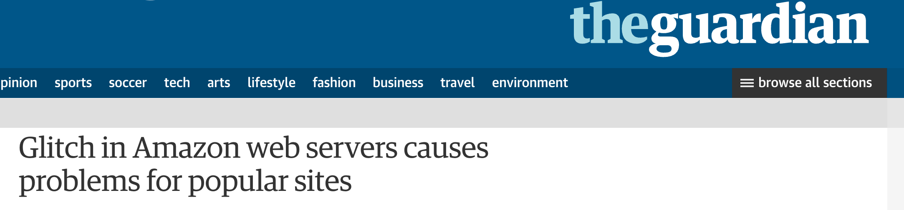
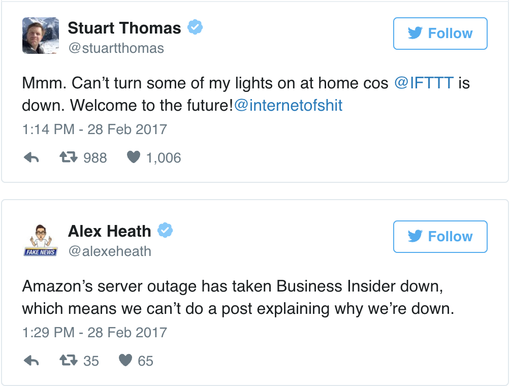
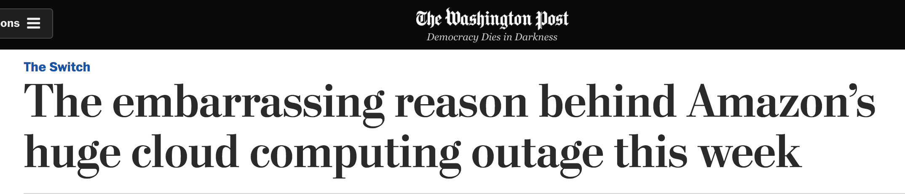
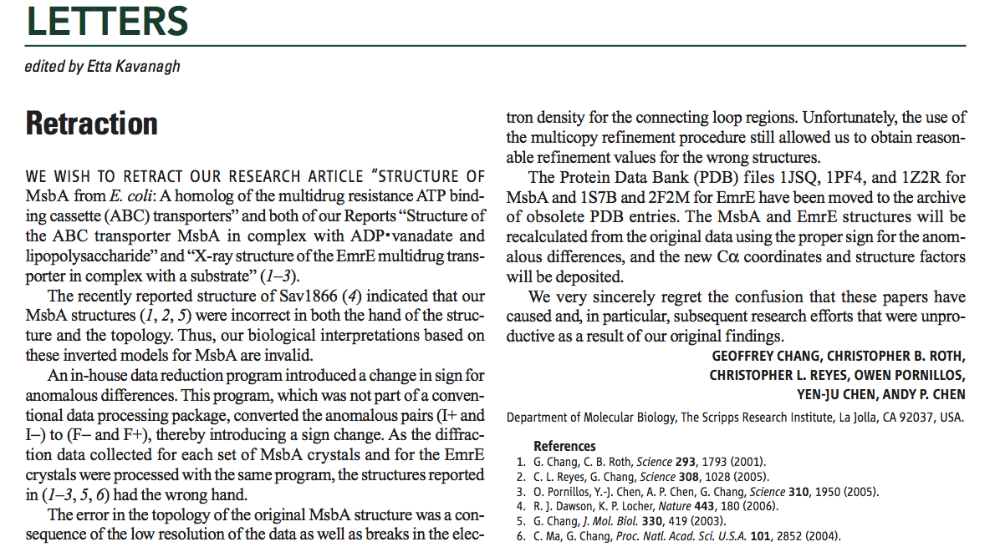
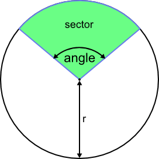

name: inverse
layout: true
class: center, middle, inverse
---
# Writing unit and regression tests

---
layout: false
##<span style="color:purple">Outline</span>

- ### Learning objectives
- ### Requirements
- ### Introduction
- ### Exercises
- ### Testing tools

---
name: inverse
layout: true
class: center, middle, inverse
---
## Learning objectives
---
layout: false

- Why do we write tests

- What are the various types of software tests

- How to write simple unit and regression tests

- What are the testing frameworks in Python

---
name: inverse
layout: true
class: center, middle, inverse
---
## Requirements
---
layout: false

- Your computer:

  - Docker + Docker image - nipype/workshops:latest-base
   or
  - Python + Pytest

- You:

  - Python (basics of NumPy, Jupyter)


---
name: inverse
layout: true
class: center, middle, inverse
---
## Introduction
---
layout: false

### <span style="color:purple"> Why do we test software?</span>

--

- #### mistakes happen and always will

---
### <span style="color:purple"> Why do we test software?</span>




--




---
### <span style="color:purple"> Why do we test software?</span>




--

- It started harmlessly:

  - *A team member was doing a bit of maintenance on Amazon Web Services Tuesday...*

--

  - *With a few mistaken keystrokes, ...*

--

  - *... The cascading failure meant that many websites could no longer make changes to the information stored on Amazon's cloud platform....*

--
- Amazon said: *We have modified this tool to remove capacity more slowly and **added safeguards to prevent** capacity from being removed when it will take any subsystem below its minimum required capacity level.*

--

**Including tests is one of the possible safeguards when writing software!**

---
### <span style="color:purple"> Why do we test software?</span>

#### And now a scientist's nightmare...

--

- A Prof. Geoffrey Chang story who had to retract 5 articles (3 from *Science*, *PNAS*, *J.Mol.Biol.*)

&nbsp;



&nbsp;

- *An in-house data reduction program introduced a change in sign...*

---
### <span style="color:purple"> Why do we test software?</span>


- makes you think about desirable output

- improves readability of your code

&nbsp;

[Excamples from Nipype code](https://github.com/nipy/nipype/blob/master/nipype/pipeline/engine/tests/test_engine.py#L45)


---
###<span style="color:purple">Various types of tests</span>

--

- Unit tests

  - work on isolated parts (units) of the program
  - verify that units operate correctly in various scenarios
  - usually compare observed results to well known expected results


- Integration tests

  - combine individual software modules and test as a group
  - similar structure as unit tests: compare observed results to  expected results, but the expected result can be more complicated to represent

&nbsp;

--

- Regression tests

  - verify that software previously developed and tested still performs correctly even after it was changed or interfaced with other software

  - you don't have to knows the expected result, the assumption is that the past results were correct.

---

### <span style="color:purple">Science and software testing</span>

- We all question/test many things in our scientific work

- When writing a program we often execute a simple example first and check the output

&nbsp;

--

- Writing software tests for your scientific code is:

  - translating your ideas for verification to programming code

  - automating the process of verification, so you can do it on a regular basis

---

name: inverse
layout: true
class: center, middle, inverse
---
## Exercises
---
layout: false

### <span style="color:purple">Assert statement</span>

&nbsp;

```bash
assert Expression[, Arguments]
```
- Python evaluates the Expression to either True or False

- if the Expression is false, `assert` returns an `AssertionError`

---
### <span style="color:purple">Assert statement</span>

- Examples:
  ```python
  assert True
  ```
  ```python
  assert False
  ```
  ```python
  assert 1 + 2 == 3
  ```
  ```python
  assert 2**0.5 < 1.5
  ```
  ```python
  assert 2 != 3
  ```
  ```python
  import math
  assert math.pi == 3.14
  ```

  ```python
  assert type(2) is int
  ```
  ```python
  assert 2 in [1,2,3]
  ```
  ```python
  assert 2 not in [1,2,3]
  ```

---
### <span style="color:purple">Finding area of a sector of a circle </span>

&nbsp;



---
### <span style="color:purple">Finding the positions of local maxima in a list of numbers  </span>

Check the output of your function for these examples:

- list: `[1, 2, 1, 0]`, expected output: `[1]`

- list: `[-1, 2, 1, 3, 2]`, expected output: `[1, 3]`

- list: `[4, 3, 4, 3]`, expected output: `[0, 2]`

---
### <span style="color:purple">Finding the mean absolute value of the list of pseudo-random numbers </span>

- `random` library: pseudo-random number generator, e.g.
  ```python
  random.sample(range(-100, 100), 10)
  ```

--

- you don't know what is the expected value of the "experiment", but you can set a seed (`random.seed(3)`) and save the output

  - the saved value can be used in a simple regression test as the expected value

---
name: inverse
layout: true
class: center, middle, inverse
---
## Testing tools
---
layout: false

### <span style="color:purple">Python testing frameworks</span>

- unittest

- nosetests

- pytest


&nbsp;

--

Which framework should you use?

- A great comparison of the frameworks you can find [here](http://pythontesting.net/start-here/)

- A short answer: **use pytest if you can**


---
### <span style="color:purple">Unit tests with Pytest library</span>


- it’s easy to get started

- straightforward asserting with the assert statement

  ```python
  def test_angle0():
      assert sector_area(5, 0) == 0
   ```

- helpful traceback and failing assertion reporting

- automatic test discovery

  ```bash
  # discovers all tests in all subdirectories
  pytest
  # runs all test from test_random.py file only
  pytest tests_random.py
  # runs one specific test
  pytest tests_random.py::test_1
  ```

- many useful features including fixtures, test parametrization, etc.

---
### <span style="color:purple">Continuous Integration</span>

- Integrating the test suite into the development process

  - Building and checking the code every time the repository changes
  - Using various environments for testing the code


  &nbsp;

- Continuous Integration Services

  - Travis CI
  - CircleCI

Example of travis file from Nipype project is [here](https://github.com/nipy/nipype/blob/master/.travis.yml).


---
name: inverse
layout: true
class: center, middle, inverse
---
# Questions?
