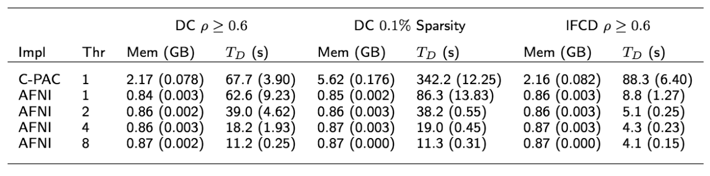

name: inverse
layout: true
class: center, middle, inverse
---
# Executing Nipype pipelines in parallel on multi-core workstations
## R. Cameron Craddock, PhD
### cameron.craddock@gmail.com
### Director of Computational Neuroimaging Lab, Nathan S. Kline Institute for Psychiatric Research, Orangeburg, NY
### Director of Imaging, Child Mind Institute, New York, NY

---
Adapted from example by Dr. Satra Ghosh

(https://github.com/satra/om-images)


[source](https://github.com/ccraddock/nipype-multicore-hpc/tree/gh-pages) | CC-BY

(Feel free to fork and update)
---
layout: false
### Neuroimaging processing and analyses are "trivially" parallelizable

#### Pipeline nodes can be run in parallel if they have no inter-dependencies

--

- Data from different participants or sessions have few (if any) inter-dependencies
  - An exception would be using study-specific templates and priors, but these could be generated first

--

- Data from different series collected on same participant and session have some inter-dependencies but are mostly independent
  - fMRI processing requires some information from structural MRI
  - Multiple series may be registered to one another

--

- Different processing steps on the same series tend to have inter-dependencies although exceptions exist

--

- Many processing algorithms treat each voxel separately
  - This level of processing is less often accessible to Nipype

--

- Monte Carlo methods for statistical significance testing involve many independent iterations

---
### Identifying parallelism


<sup><sub>from Gorgolewski, K. et al. Front. Neuroinform., 22 August 2011 | [https://doi.org/10.3389/fninf.2011.00013](https://doi.org/10.3389/fninf.2011.00013)

---
### Benefits of parallel execution

The speedup obtained via parallel execution is determined by Amdahl's Law


<sup><sub>from https://www.pugetsystems.com/labs/articles/Estimating-CPU-Performance-using-Amdahls-Law-619/</sub></sup>

- Practically it can be difficult to achieve perfect speedup (i.e. S(n) = n) due to a variety of "bottlenecks" --- even when executing completely independent pipelines on separate nodes of a cluster!

  - access to shared resources must be serialized to avoid errors
  - increased traffic on system bus or network slows throughput

---
### Maximizing speedup

- Minimize network traffic
  - execute nodes with inter-dependencies on the same workstation or cluster node

- Minimize use of shared resources
  - use local storage for intermediate files and only write outputs to shared storage

- Maximize the utilization of system resources
  - unused processors and memory are wasted resources
  - must be careful *NOT* to overwhelm resources

---
### Resource management

- Executing more threads than available processors (not so bad)
  - Doesn't really cause a problem, system will "slog away" until processing is done
  - System may become less responsive for interactive users

--

- Using more memory than available RAM (**<span style="color:red">this is BAD!</span>**)
  - Results in system grinding to a halt as memory is swapped in and out of hard drive at each task switch
  - System will eventually become completely unresponsive
  - If available, out-of-memory killer will kill your pipeline to free memory
  - May require hard reboot to recover the workstation, which can(and often does) result in file system corruption

--

- Filling up hard drive (**<span style="color:red">this is BAD!</span>**)
  - Will crash your pipeline

---
### Nipype tricks for resource management on multi-core systems

A common issue exists when one or more node requires a substantial amount of memory, while executing the node alone may be OK, executing it at the same time as other nodes may exceed resources and cause havoc. Possible solutions:

- Run all nodes serially
  - <span style="color:red">CON: nodes with smaller memory requirements are forced to run serially, wasting system resources</span>

--

- Add dependencies between nodes to prevent them from executing in parallel --- allowing other nodes to execute in parallel
  - <span style="color:red">CON: is a static solution that requires a lot of effort to implement and does not automatically adapt to systems with larger resources</span>

--

**(Relatively) New solution**
- Add functionality to MultiProc plugin to execute nodes based on their needs and real-time estimates of available resources

---
### Specifying node requirements

The interface base class contains estimates of the amount of memory and number of threads required to execute a node:

```python
def __init__(self, from_file=None, **inputs):
    if not self.input_spec:
        raise Exception('No input_spec in class: %s' %
                        self.__class__.__name__)

    self.inputs = self.input_spec(**inputs)
    self.estimated_memory_gb = 1
    self.num_threads = 1

    if from_file is not None:
        self.load_inputs_from_json(from_file, overwrite=True)

        for name, value in list(inputs.items()):
            setattr(self.inputs, name, value)
```

These are updated when building a pipeline:

```python
n1 = pe.Node(interface=SingleNodeTestInterface(), name='n1')

n1.interface.estimated_memory_gb = 4
n1.interface.num_threads = 2
```

---
### Scheduling nodes

Nodes are only selected to run when there is enough free memory and free processors to meet its needs. Nodes with larger requirements are prioritized to get them out of the way.

```python
# Sort jobs ready to run first by memory and then by number of threads
# The most resource consuming jobs run first
jobids = sorted(jobids,
                key=lambda item: (self.procs[item]._interface.estimated_memory_gb,
                                  self.procs[item]._interface.num_threads))

if str2bool(config.get('execution', 'profile_runtime')):
    logger.debug('Free memory (GB): %d, Free processors: %d',
                 free_memory_gb, free_processors)

# While have enough memory and processors for first job
# Submit first job on the list
for jobid in jobids:
    if str2bool(config.get('execution', 'profile_runtime')):
        logger.debug('Next Job: %d, memory (GB): %d, threads: %d' \
                     % (jobid,
                        self.procs[jobid]._interface.estimated_memory_gb,
                        self.procs[jobid]._interface.num_threads))

    if self.procs[jobid]._interface.estimated_memory_gb <= free_memory_gb and \
       self.procs[jobid]._interface.num_threads <= free_processors:
        logger.info('Executing: %s ID: %d' %(self.procs[jobid]._id, jobid))
        executing_now.append(self.procs[jobid])
```

---
### Executing the workflow

When executed, the plugin needs to know the total amount of memory and processors allocated for its execution.

```python
# Run workflow
plugin_args = {'n_procs' : num_threads,
               'memory_gb' : num_gb}
wf.run(plugin='MultiProc', plugin_args=plugin_args)
```

---
### Estimating resource needs

- The ability of the MultiProc plugin to avoid out-of-memory errors and maximize utilization depends on how well the memory needs of a node are estimated.
- A system profiler enables this information to be tracked.

```python
# Run workflow
plugin_args = {'n_procs' : num_threads,
               'memory_gb' : num_gb,
               'status_callback' : log_nodes_cb}
wf.run(plugin='MultiProc', plugin_args=plugin_args)
```

- The ```draw_gantt_chart.py``` utility will create a Gantt chart from the resulting log file.


---
### Multi-threading


<span style="font: normal 11pt Arial; line-height: 11pt;">Comparison of Python (C-PAC) and C (AFNI) implementations of degree centrality (DC) and local functional connectivity density (lFCD). Thr: number of threads, average and standard deviation are reported for memory usage (Mem) and execution time (T_D).</span>

- ANTs, FreeSurfer, and AFNI use [OpenMP](http://www.openmp.org/) to parallelize computation

- There is a trade-off between running multiple nodes in parallel or executing a single node using multiple threads

  - Overhead such as file I/O may dominate time spent on voxel-wise calculations that can be parallelized, resulting in diminishing returns

- But, memory used by these algorithms do not scale with thread count in the same way that it scales with running multiple nodes

  - Multi-threading enables marginal speedups and better processor utilization when memory is limited

---
### Project ideas for improving Nipype's MultiProc Plugin's resource management

- Replace variables containing memory and thread estimates with functions that estimate these values from inputs at runtime

  - Create these functions for commonly used interfaces

- Modify scheduler to dynamically configure the number of threads that a node uses at runtime based on memory usage and number of free processors

- Update FSL DTI preprocessing pipeline to use resource manager and test

- Create multi-proc plugin that can manage "bundles of pipelines" to improve resource utilization

---
# Questions
